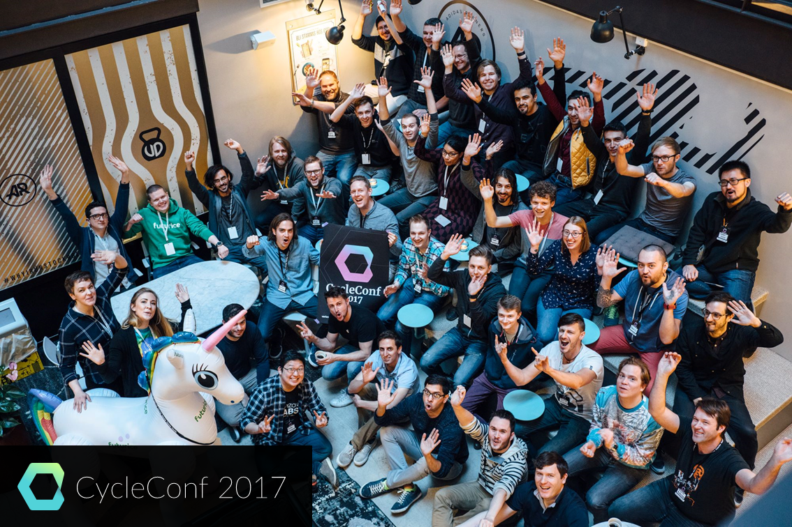

# Introduction to Cycle.js

> This is the material for my introductory talk about Cycle.js I held after attending CycleConf 2017.

## Examples
All the examples can be found under `./src`.

## Slides
The slides are available [@./slides.pptx](./slides.pptx) and [@OneDrive](https://mayrio-my.sharepoint.com/:p:/g/personal/bernhard_mayr_io/EZv0VsQVM7tAlYlP3b-HcU8BWjRdojuml8Lf1l3suGNKCw?e=gmjuMp).

## Presentations
- *07.06.2017:* [stahlstadt.js // 14. Meetup - Stahlstadt.js](https://www.meetup.com/de-DE/stahlstadt-js/events/239660401/) [:file_folder:](https://github.com/bemayr/talk.intro-to-cyclejs/releases/tag/2017-06-07-stahlstadtjs)
- *29.03.2018:* [ReactJS Tirol // React March Meetup](https://www.meetup.com/de-DE/ReactJS-Tirol/events/248158228/) [:file_folder:](https://github.com/bemayr/talk.intro-to-cyclejs/releases/tag/2018-03-29-reactjstirol)
