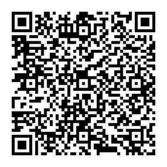

# Introduction to Cycle.js

> This is the material for my introductory talk about Cycle.js I held after attending CycleConf 2017.

## Examples
All the examples can be found under `./src`.

## Slides
The slides are available on OneDrive [here](https://mayrio-my.sharepoint.com/personal/bernhard_mayr_io/_layouts/15/guestaccess.aspx?docid=0cb18e312559a4c258b4f797e4da0277d&authkey=AVbvrh8T7VgY6RYNaymJjuo) or by scanning the following QR-Code.

