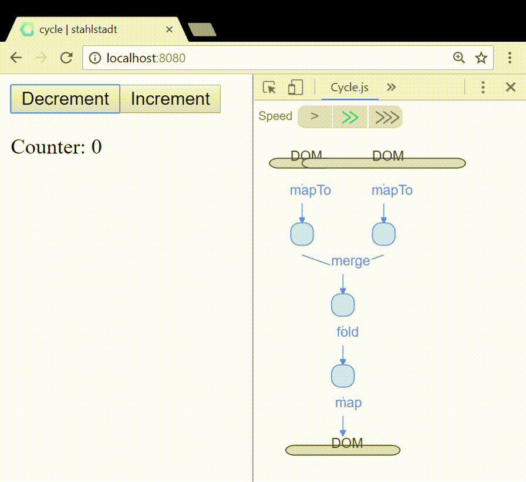

# Cycle.js counter app
> taken from: https://cycle.js.org/basic-examples.html#basic-examples-increment-a-counter

## How-To Run It?
```
# install dependencies
npm install

# serve with hot reload at localhost:8080
npm start
```

## Cycle.js Dev-Tools

https://chrome.google.com/webstore/detail/cyclejs/dfgplfmhhmdekalbpejekgfegkonjpfp